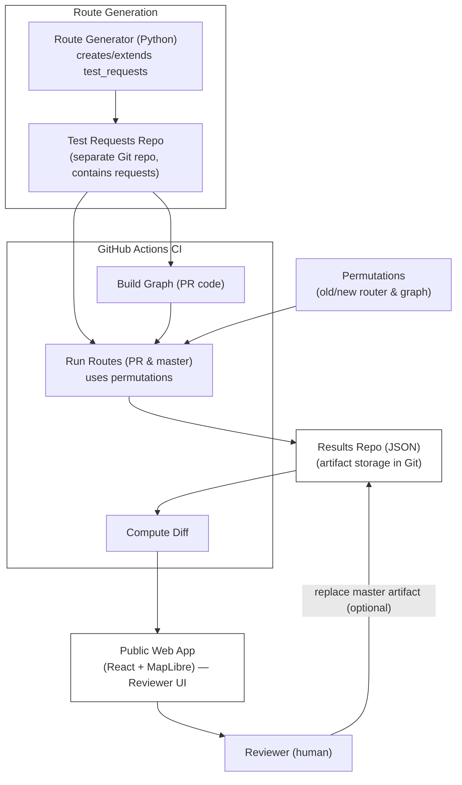

## Overall QA/QC Tool Architecture proposal

```mermaid
flowchart TD
	%% Top-down architecture for routing QA/QC
	subgraph Route_Generation [Route Generation]
		RG["Route Generator (Python)<br/>creates/extends test_requests"]
		TR["Test Requests Repo<br/>(separate Git repo, contains requests)"]
	end

	subgraph CI [GitHub Actions CI]
		A1["Build Graph (PR code)"]
		A2["Run Routes (PR & master)<br/>uses permutations"]
		A3["Compute Diff"]
	end

	ResultsRepo["Results Repo (JSON)<br/>(artifact storage in Git)"]
	WebApp["Public Web App<br/>(React + MapLibre) — Reviewer UI"]
	Reviewer["Reviewer (human)"]
	Perm["Permutations<br/>(old/new router & graph)"]

	RG --> TR
	TR --> A1
	TR --> A2
	A1 --> A2
	A2 --> ResultsRepo
	ResultsRepo --> A3
	A3 --> WebApp
	WebApp --> Reviewer
	Reviewer -->|"replace master artifact (optional)"| ResultsRepo
	Perm --> A2

	style Route_Generation fill:#ffffff,stroke:#333,stroke-width:1px
	style CI fill:#ffffff,stroke:#333,stroke-width:1px
	style ResultsRepo fill:#ffffff,stroke:#333,stroke-width:1px
	style WebApp fill:#ffffff,stroke:#333,stroke-width:1px

```
