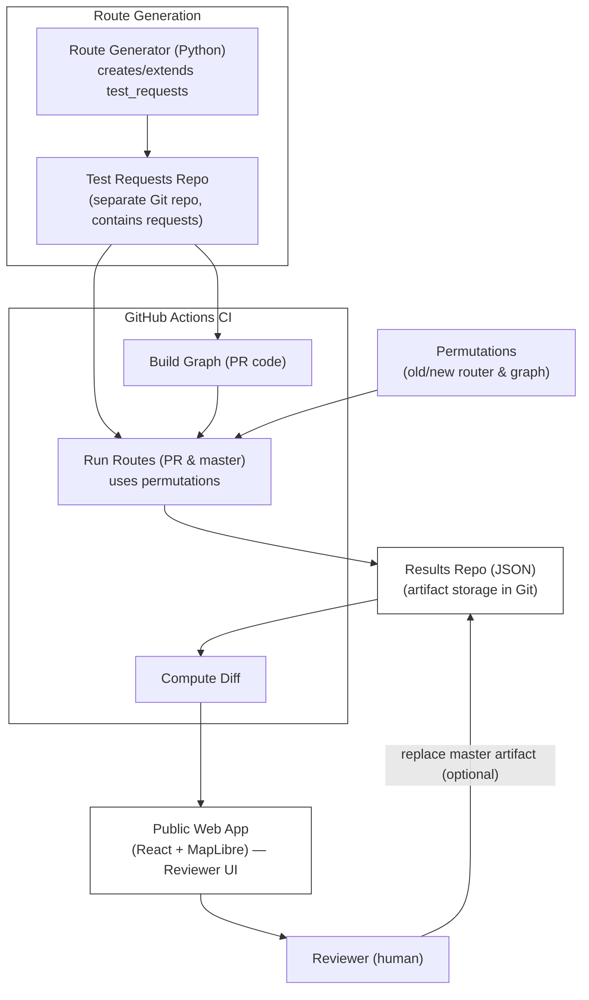

# RAD — Real world, Analyze, Delta

Automated routing QA framework for the [Valhalla](https://github.com/valhalla/valhalla) routing engine.


## Overall QA/QC Tool Architecture proposal


## Route Generator

Generates a JSONL file of randomized Valhalla `/route` requests — random coordinate pairs within Switzerland combined with hardcoded costing bundles. Output is ready to be sent to a Valhalla instance.


### Getting started

This project uses [`uv`](https://docs.astral.sh/uv/) as its package manager. Plain `pip` works too.


**With uv (recommended)**
```bash
curl -Ls https://astral.sh/uv/install.sh | sh
uv sync
uv run route-generator
```

**With pip**
```bash
python -m venv .venv
source .venv/bin/activate
pip install -e .
route-generator
```

### Usage

```
uv run route-generator [--output PATH] [--count N] [--seed INT]
```

| Option | Default | Description |
|---|---|---|
| `--output` | `requests.jsonl` | Path to write the JSONL file |
| `--count` | `1000` | Number of origin/destination pairs |
| `--seed` | random | Integer seed for reproducible output |

The seed is always printed — even when auto-generated — so you can reproduce any run:

```
Written 1000 requests to requests.jsonl (seed=3267999685)
```

To reproduce: `uv run route-generator --seed 3267999685`


### Output format

One JSON object per line (JSONL). Each line is a complete Valhalla `/route` request body:

```json
{"locations":[{"lon":8.123456,"lat":47.234567},{"lon":7.654321,"lat":46.789012}],"costing":"auto","costing_options":{}}
```

With default settings: 1000 pairs × 1 costing bundles = **1000 requests**.


### Development setup

```bash
uv sync
uv run pre-commit install
uv run ruff check --fix .
uv run ruff format .
uv run pytest
```

### Project structure

```
route_generator/
    __init__.py
    main.py          # CLI entry point
    generator.py     # core logic — polygon loading, sampling, request building
data/
    switzerland.geojson   # vendored Natural Earth country polygon
tests/
    test_generator.py
pyproject.toml
.pre-commit-config.yaml
```
