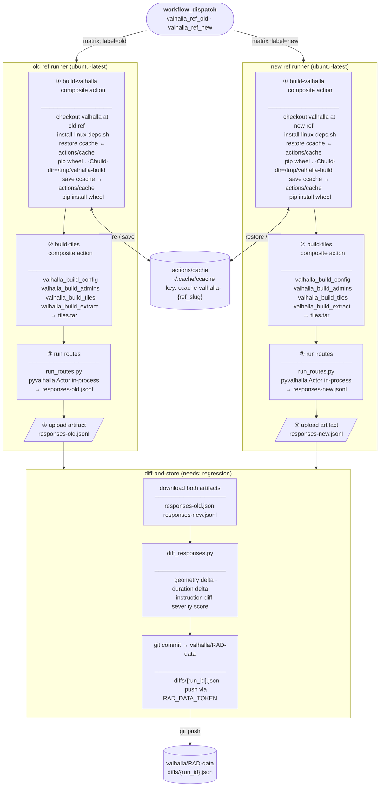

# RAD — Routing Regression Pipeline

## Storage layout

| Data | Where | Lifetime |
|------|--------|----------|
| ccache object files | GitHub `actions/cache` | until evicted (7-day LRU) |
| pyvalhalla wheel (16MB) | `/tmp/valhalla-dist` on runner | single job |
| graph tiles tar | `/tmp/valhalla_tiles` on runner | single job |
| route responses | GHA artifact | 7 days |
| diff results | `valhalla/RAD-data` git commit | permanent |
